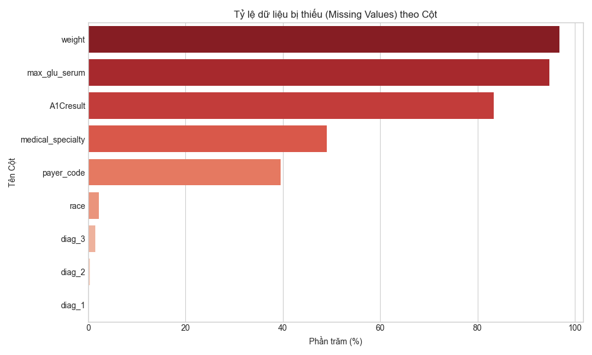
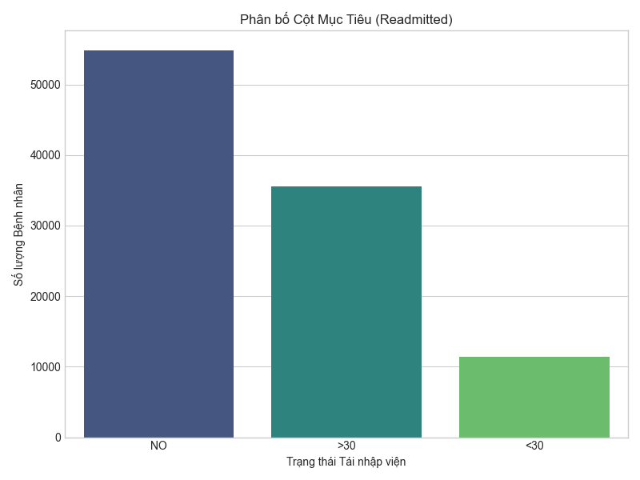
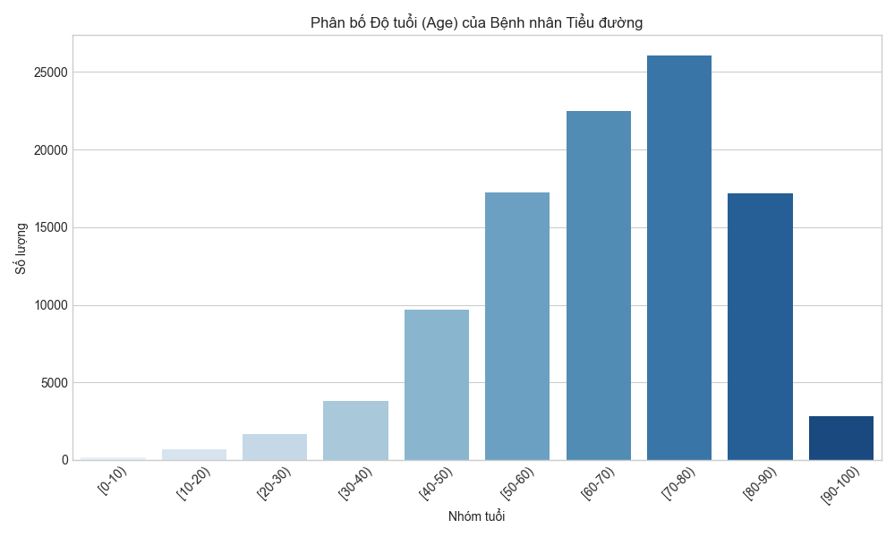

# Báo cáo Tổng quan Phân tích Dữ liệu (EDA Report)
**Ngày phân tích:** Hôm nay
**Nguồn dữ liệu:** UCI Diabetes 130-US hospitals (1999-2008)

## 1. Tổng quan kích thước dữ liệu
- **Tổng số dòng (Số lượng bệnh án):** 101,766
- **Tổng số cột (Đặc trưng):** 50

## 2. Các cột bị thiếu dữ liệu (Missing Values)
*Dữ liệu gốc sử dụng ký tự `?` để biểu diễn giá trị bị thiếu. Chúng tôi đã chuyển đổi sang `NaN` để phân tích.*

| Tên Cột | Số lượng thiếu | Tỷ lệ (%) |
|---|---|---|
| weight | 98,569 | 96.86% |
| max_glu_serum | 96,420 | 94.75% |
| A1Cresult | 84,748 | 83.28% |
| medical_specialty | 49,949 | 49.08% |
| payer_code | 40,256 | 39.56% |
| race | 2,273 | 2.23% |
| diag_3 | 1,423 | 1.40% |
| diag_2 | 358 | 0.35% |
| diag_1 | 21 | 0.02% |

**Nhận xét về dữ liệu thiếu:**
- Cột `weight` (Cân nặng) bị thiếu tới **~97%**, do đó cột này không mang lại giá trị học máy và nên bị loại bỏ trong bước tiền xử lý (Drop).
- Cột `medical_specialty` (Chuyên khoa) và `payer_code` (Mã bảo hiểm) cũng bị thiếu khá nhiều (>39%), có thể cân nhắc gộp nhóm "Unknown" thay vì xóa bỏ.

## 3. Phân bố Nhãn Mục tiêu (Readmitted)
Cột `readmitted` là biến chúng ta cần dự đoán, bao gồm 3 lớp:
- **NO**: Không tái nhập viện.
- **>30**: Tái nhập viện sau 30 ngày.
- **<30**: Tái nhập viện dưới 30 ngày (ĐÂY LÀ NHÓM RỦI RO CAO NHẤT CẦN DỰ ĐOÁN).

**Nhận xét:**
Dữ liệu bị **mất cân bằng (Imbalanced)**. Số lượng bệnh nhân không tái nhập viện (NO) chiếm tỷ trọng lớn, trong khi nhóm mục tiêu (<30 ngày) chiếm tỷ lệ nhỏ nhất (~11%). Trong quá trình huấn luyện, nhóm đã phải dùng kỹ thuật (như gộp nhóm NO và >30 lại thành 0, và <30 thành 1 để chuyển về bài toán nhị phân) và sử dụng thuật toán như XGBoost kết hợp trọng số để xử lý sự mất cân bằng này.

## 4. Phân bố Độ Tuổi (Age)
Tiểu đường là bệnh lý ảnh hưởng mạnh bởi độ tuổi.

**Nhận xét:**
Phần lớn bệnh nhân nhập viện nằm trong độ tuổi từ 50 đến 90 tuổi, đỉnh điểm là nhóm `[70-80)`. Điều này hoàn toàn phù hợp với thực tế y khoa rằng người cao tuổi thường mắc nhiều bệnh lý nền, dẫn đến nguy cơ biến chứng và tái nhập viện cao hơn.
